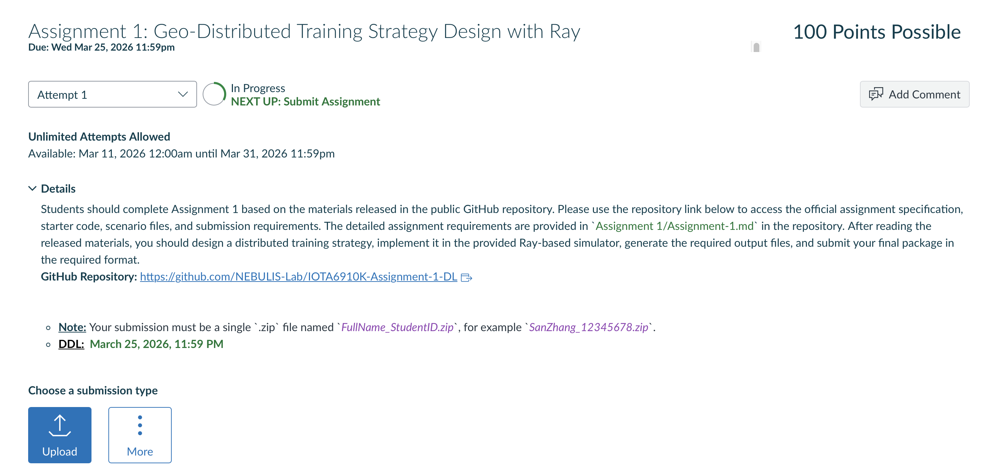

# IOTA6910K Assignment 1

> **Release Date:** March 11, 2026  
> **Deadline:** March 25, 2026, 11:59 PM

**Repository:** [https://github.com/NEBULIS-Lab/IOTA6910K-Assignment-1-DL](https://github.com/NEBULIS-Lab/IOTA6910K-Assignment-1-DL)

## Assignment Overview

This assignment concerns distributed learning system design in a virtual geo-distributed GPU environment. The objective is to reason about how a large training job should be placed, synchronized, and coordinated when compute resources are distributed across regions with different hardware capabilities, network links, and monetary costs.

You are **not** asked to train a real large model or deploy a real cluster. Instead, you will develop a distributed training strategy, explain its rationale, and evaluate it with a laptop-friendly Ray-based simulator that models workers, regional aggregators, and a global coordinator.

## Problem Formulation

You are given:

- a virtual geo-distributed GPU cluster made of multiple regions
- heterogeneous GPU types with different compute throughput and hourly cost
- different intra-region and inter-region bandwidth / latency
- a large-model training task described by model size, gradient size, and target training steps

Your task is to determine how the available resources should be used efficiently.

## Required Tasks

This assignment has four required components.

### 1. Design a Distributed Training Strategy

Your strategy should explain which clusters are selected, how many GPUs are allocated in each cluster, how work is assigned across heterogeneous GPUs, whether synchronization is flat or hierarchical, and how often global synchronization takes place. The goal is not simply to use all available resources, but to make a coherent systems decision that balances computation, communication, and cost.

### 2. Provide System-Level Pseudocode

You must write system-level or algorithmic pseudocode for your strategy. The pseudocode should clearly describe how workers perform local computation, how gradients or parameters are synchronized, how cross-region communication is handled, and how your design differs from the provided baselines.

### 3. Implement the Strategy in the Provided Ray Simulator

You are given a Ray actor-based simulator starter. Your main implementation work should be carried out in [`strategies/student_custom_strategy.py`](strategies/student_custom_strategy.py). You should then run your strategy on the required scenarios and compare it with the provided baselines. The Ray runtime is used only to simulate distributed execution roles such as workers, regional aggregators, and a global coordinator. You are not required to deploy a real cluster.

### 4. Analyze and Interpret the Results

You must compare your strategy with the baselines using the simulator outputs and explain the observed training time, communication time, communication volume, GPU-hour cost, and the tradeoff between synchronization frequency and convergence penalty.

## Required Scenarios

You must run your strategy on both scenarios:

- `scenarios/world_mix.json`
- `scenarios/budget_pressure.json`

An additional optional stress-test scenario may be used for stronger analysis:

- `scenarios/regional_chokepoint.json`

## Provided Code Structure

The starter code is organized so that strategy design and simulator internals are clearly separated:

| Path | Purpose |
| --- | --- |
| [`scenarios/`](scenarios) | Virtual cluster and task configurations |
| [`scripts/run_baselines.py`](scripts/run_baselines.py) | Runs the provided baseline strategies |
| [`scripts/run_custom.py`](scripts/run_custom.py) | Runs your custom strategy and compares it with the baselines |
| [`simulator/core.py`](simulator/core.py) | Time, communication, and cost estimation logic |
| [`simulator/actors.py`](simulator/actors.py) | Ray actors representing cluster workers, regional aggregators, and the global coordinator |
| [`simulator/runtime_ray.py`](simulator/runtime_ray.py) | Orchestrates the local Ray-based execution flow |
| [`strategies/student_custom_strategy.py`](strategies/student_custom_strategy.py) | Main file you are expected to modify |

## Baseline Strategies

The starter package includes three baseline strategies:

1. `single_region_fastest`
2. `all_regions_flat_dp`
3. `all_regions_hierarchical_dp`

Your custom strategy must be compared against all three baselines.

## Submission Files and Format

Submit the following files and folders exactly:

1. `strategies/student_custom_strategy.py`
2. `report.pdf`
3. `outputs/world_mix_comparison.csv`
4. `outputs/budget_pressure_comparison.csv`

If you also analyze the optional scenario, you may additionally submit:

- `outputs/regional_chokepoint_comparison.csv`

Keep the relative paths exactly as shown above in your submission package. Do not rename the required files. Your final submission must be a single `.zip` archive named `FullName_StudentID.zip`, for example `SanZhang_12345678.zip`. The submission window is available in Canvas under `Assignments`, where you should upload the final `.zip` package.



## Permitted Code Modifications

At minimum, you are expected to modify [`strategies/student_custom_strategy.py`](strategies/student_custom_strategy.py). You may add helper functions in that file. If you modify any other provided file, document exactly what you changed and why in `report.pdf`. Do not modify the scenario JSON files or manually edit the generated CSV result files.

> **Note**
> The submitted comparison CSV files must be generated by the provided scripts. Hand-edited result files will not be treated as valid experimental outputs.

> **Note**
> Late submissions received within 24 hours after the deadline will lose 25% of the total score. After that, each additional 24-hour period will result in another 15% deduction from the total score.

## Policy on AI Assistance

You may use ChatGPT or other AI tools to help with code implementation, pseudocode drafting, debugging, or brainstorming. However, the core design decisions, tradeoff analysis, and final explanation should reflect your own understanding. In `report.pdf`, include a short disclosure describing which AI tools you used and what they were used for.

Your `report.pdf` must contain:

1. a short description of the virtual cluster and training task
2. a clear description of your distributed training strategy
3. pseudocode for your strategy
4. tables or plots comparing your strategy with all baselines
5. a discussion of why your strategy performs better or worse
6. at least one failure case or limitation of your design

At minimum, your pseudocode should describe:

- worker-side local computation
- workload allocation across clusters
- region-level or global synchronization steps
- the rule for when global synchronization happens

## Setup and Execution

Run from the `Assignment 1/` folder.

Before you run the simulator, make sure you have:

- Python 3.10 or newer
- `pip`
- the package listed in `requirements.txt` (currently `ray`)

Recommended setup:

```bash
python3 -m venv .venv
. .venv/bin/activate
```

Then install the required dependency:

```bash
python3 -m pip install -r requirements.txt
```

No GPU is required. The Ray runtime is used only for local simulation on your laptop.

> **Note**
> You do not need a real multi-node cluster. The provided Ray runtime starts locally on your laptop and is only used to represent distributed execution roles in the simulator.

Baseline runs:

```bash
python3 scripts/run_baselines.py scenarios/world_mix.json
python3 scripts/run_baselines.py scenarios/budget_pressure.json
```

Custom strategy runs:

```bash
python3 scripts/run_custom.py scenarios/world_mix.json
python3 scripts/run_custom.py scenarios/budget_pressure.json
```

These commands write CSV summaries into `outputs/`.

They also write JSON trace files into `outputs/` so you can inspect the simulated worker / region / global synchronization events. Those trace files are optional and do not need to be submitted.

## Characteristics of Strong Solutions

A strong strategy usually balances several factors rather than optimizing only one:

- use faster GPUs where they matter most
- avoid unnecessary cross-region synchronization
- reduce communication bottlenecks
- keep convergence penalty under control
- avoid exploding cost for small time gains

There is no single correct answer. The goal is to present a defensible systems design supported by simulation results.

## Grading Criteria

Total score: 100

| Component | What is evaluated | Points |
| --- | --- | ---: |
| Strategy design | Quality of the proposed distributed training plan; cluster selection, synchronization structure, and resource usage are coherent and well motivated | 25 |
| Pseudocode | Pseudocode is technically correct, clear, and reflects the actual proposed system behavior | 20 |
| Solution reasoning and analysis | Quality of tradeoff reasoning, explanation of results, and discussion of limitations or failure cases | 15 |
| Code implementation | `student_custom_strategy.py` runs correctly with the provided Ray simulator and produces valid comparison outputs | 20 |
| Experimental results | Required comparison CSV files are complete, baseline comparisons are correct, and reported metrics are used properly | 20 |

Interpretation:

- strategy design + pseudocode + reasoning = 60 points
- code + experimental results = 40 points

Strong submissions usually do two things well:

1. propose a sensible strategy for geo-distributed execution
2. explain clearly why the observed time / communication / cost tradeoffs make sense

## References

These references are optional background reading. They are not required to complete the assignment, but they are useful if you want more context on Ray and distributed training systems.

1. Ray Team. [Ray Documentation](https://docs.ray.io/en/latest/index.html). Official documentation for Ray Core and local runtime usage.
2. Ray Team. [Ray Core Actors](https://docs.ray.io/en/latest/ray-core/actors.html). Official guide to the actor abstraction used in the provided simulator.
3. Ray Team. [Ray Core Tasks](https://docs.ray.io/en/latest/ray-core/tasks.html). Official guide to remote tasks and asynchronous execution in Ray.
4. Ray Team. [ray on PyPI](https://pypi.org/project/ray/). Official package and installation reference for the Ray Python distribution.
5. Dean, J., Corrado, G., Monga, R., Chen, K., Devin, M., Le, Q. V., Mao, M., Ranzato, M., Senior, A., Tucker, P., Yang, K., and Ng, A. Y. [Large Scale Distributed Deep Networks](https://papers.nips.cc/paper_files/paper/2012/hash/6aca97005c68f1206823815f66102863-Abstract.html). *Advances in Neural Information Processing Systems (NeurIPS 2012)*.
6. Li, M., Andersen, D. G., Park, J. W., Smola, A. J., Ahmed, A., Josifovski, V., Long, J., Shekita, E. J., and Su, B.-Y. [Scaling Distributed Machine Learning with the Parameter Server](https://www.usenix.org/conference/osdi14/technical-sessions/presentation/li_mu). *11th USENIX Symposium on Operating Systems Design and Implementation (OSDI 2014)*.
7. Huang, Y., Cheng, Y., Bapna, A., Firat, O., Chen, D., Chen, M., Lee, H., Ngiam, J., Le, Q. V., Wu, Y., and Chen, Z. [GPipe: Efficient Training of Giant Neural Networks using Pipeline Parallelism](https://papers.nips.cc/paper_files/paper/2019/hash/093f65e080a295f8076b1c5722a46aa2-Abstract.html). *Advances in Neural Information Processing Systems (NeurIPS 2019)*.
8. Zheng, L., Li, Z., Zhang, H., Zhuang, Y., Chen, Z., Huang, Y., Wang, Y., Xu, Y., Zhuo, D., Xing, E. P., Gonzalez, J. E., and Stoica, I. [Alpa: Automating Inter- and Intra-Operator Parallelism for Distributed Deep Learning](https://www.usenix.org/conference/osdi22/presentation/zheng-lianmin). *16th USENIX Symposium on Operating Systems Design and Implementation (OSDI 2022)*.
